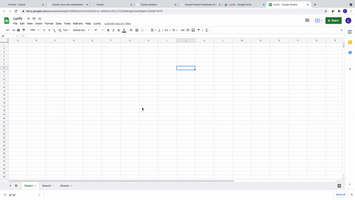

# Lucify-Sheets-Table-Creator
A school project made for design. 🏫 It is a google suite add on, built specifically for use with google spreadsheets. You can use it to programmatically create tables. ⌨️

## To use:
 → Create new spreadsheet 
 → Navigate to tools > script editor 
 → Create new files according to the files above 
 → Copy-paste the code into those files, and save 
 → Refresh the spreadsheets tab, and you should see the Lucify element, in menu bar 

